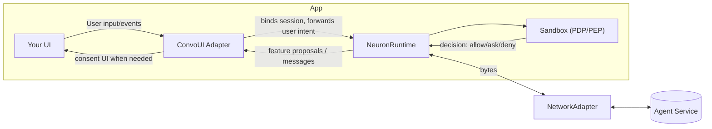

# FinClip Neuron — Developer Guide

> 📖 **Language**: [English](README.md) | [中文](README.zh.md)

## 1. Introduction

FinClip Neuron provides a runtime and SDKs to build agent‑driven experiences safely on mobile, desktop, and IoT devices. It combines:

- Capability Model‑based sandbox with fine‑grained controls (least privilege, user consent, rate limits) to let cloud agents orchestrate local functions under user permission, enabling Human‑in‑the‑Loop automation.
- A conversation runtime (NeuronKit) that turns agent proposals into safe, auditable actions.
- Device‑side context collection (e.g., location, time/schedule, network, environment, and more than a dozen categories) to accompany user intent and help agents infer intent for smarter automation. See: [`Device-side Context`](docs/context.md).
- Multi‑scene conversation management to open and continue sessions anywhere in your app, layering conversational UX on top of traditional touch/mouse interactions for seamless scene‑aware experiences, converging clickstream with dialog stream seamlessly
- Integration with a cloud Context Engine to manage user/device/app/scene data and multi‑form memories (Semantic, Short‑term, Long‑term, Episodic, Procedural), enabling better user understanding and smarter automation.

This repository publishes NeuronKit and example apps, and hosts binary XCFrameworks for SandboxSDK and convstorelib.

- Repo path to explore:
  - `finclip-neuron/examples/custom/` — a CLI example you can run with `swift run`.
- Detailed platform guidance lives in [`docs/developer-guide.md`](docs/developer-guide.md).

---

## 2. Core Concepts

- **Capability Model-based Sandbox: Features → Capabilities → Primitives**
  - A Feature describes a high-level function (e.g., "Open Camera").
  - Each Feature requires one or more Capabilities (e.g., UI access, device sensor access).
  - Capabilities are exercised by concrete Primitives (e.g., `MobileUI(page:"/camera", component:"camera")`).

- **PDP (Policy Decision Point)**
  - Evaluates whether a proposed action is allowed. Inputs include: user presence, explicit consent, sensitivity, rate limits, historical usage.

- **PEP (Policy Enforcement Point)**
  - Enforces the PDP decision in the app runtime. If denied, the action is blocked. If allowed with consent, it prompts UI.

- **Context**
  - Device Context: device type, timezone, network/battery, etc.
  - Application/Scenario Context: app-specific state, current screen/route, business metadata.

- **Feature Invocation (Tools)**
  - Agents propose directives referencing Feature IDs and typed args. The runtime validates arguments (FeatureArgsSchema) and policies before invoking primitives.

---

## Architecture Overview



Key points:

- **ConvoUI Adapter** bridges your UI and the runtime (typical apps do not call `sendMessage` directly).
- **Sandbox** evaluates policy (PDP) and the app enforces it (PEP) by showing consent and shaping execution.
- **NetworkAdapter** is pluggable (WebSocket/HTTP/custom) and transports messages to your agent backend.

---

## 3. Installation and Dependencies

Add the package to your SwiftPM manifest:

```swift
// Package.swift
dependencies: [
  .package(url: "https://github.com/Geeksfino/finclip-neuron.git", branch: "main-swift6_0")
],

targets: [
  .executableTarget(
    name: "YourApp",
    dependencies: [
      .product(name: "NeuronKit", package: "finclip-neuron"),
      .product(name: "SandboxSDK", package: "finclip-neuron"),
      .product(name: "convstorelib", package: "finclip-neuron")
    ]
  )
]
```

Binary artifacts provided by this repo:

- `NeuronKit.xcframework`
- `SandboxSDK.xcframework`
- `convstorelib.xcframework`

---

## 4. Quick Start (Primary integration steps)

The primary SDK integration sequence is:

1) Create a configuration.
2) Initialize the runtime.
3) Get a reference to the sandbox.
4) Register features and set policies.

Setting network and ConvoUI adapters is optional/advanced. Applications typically do not call `runtime.sendMessage` directly; your chosen UI/adapter integration will drive messaging.

Minimal integration snippet:

```swift
import NeuronKit
import SandboxSDK

// 1) Configuration
// Storage is persistent by default; override with `storage: .inMemory` for tests/demos
let config = NeuronKitConfig(
  serverURL: URL(string: "wss://agent.example.com")!,
  deviceId: "demo-device",
  userId: "demo-user",
  storage: .persistent, // default; use .inMemory for tests
  contextProviders: [  // all optional. This array can be empty.
    ScreenStateProvider(),   // detect screen on/off and orientation
    ThermalStateProvider(),  // detect thermal state
    DeviceEnvironmentProvider(), // detect locale and time format
    TimeBucketProvider(), // detect time of day and week
    NetworkQualityProvider(), // detect network quality
    NetworkStatusProvider(), // detect network status
    CalendarPeekProvider(), // detect next calendar event
    BarometerProvider(), // detect ambient pressure
    DeviceStateProvider(), // iOS battery level/state
    LocationContextProvider(), // requires app to have location permission; provider will not prompt
    RoutineInferenceProvider(), // infer routine
    UrgencyEstimatorProvider() // estimate urgency
  ]
)

// 2) Initialize runtime
let runtime = NeuronRuntime(config: config)

// 3) Get sandbox reference
let sandbox = runtime.sandbox

// 4) Register Features and set Policies
let camera = SandboxSDK.Feature(
  id: "open_camera",
  name: "Open Camera",
  description: "Access device camera for photos",
  category: .Native,
  path: "/camera",
  requiredCapabilities: [.UIAccess],
  primitives: [.MobileUI(page: "/camera", component: "camera")]
)
_ = sandbox.registerFeature(camera)

_ = sandbox.setPolicy("open_camera", SandboxSDK.Policy(
  requiresUserPresent: true,
  requiresExplicitConsent: true,
  sensitivity: .medium,
  rateLimit: SandboxSDK.RateLimit(unit: .minute, max: 10)
))

// Optional (advanced): configure adapters
// runtime.setNetworkAdapter(MyWebSocketNetworkAdapter(url: URL(string: "wss://...")!))

// Open a conversation when your app is ready to converse (fluent API)
let convo = runtime.openConversation(agentId: UUID())
// Optionally bind a UI adapter for streaming messages
// convo.bindUI(MyConvoAdapter())
```

To see a working end‑to‑end demo (with a simple CLI adapter and loopback networking), run:

```bash
cd finclip-neuron/examples/custom
swift run
```

---

## 5. Sandbox Usage (Typed API, Manifest, PDP)

- **Typed API (FeatureArgsSchema)**
  - Define required/optional args and constraints for each Feature.
  - The runtime validates agent-provided args against the schema before invocation.

```swift
let exportFeature = SandboxSDK.Feature(
  id: "export_report",
  name: "Export Report",
  description: "Export a report with a given format",
  category: .Native,
  path: "/report/export",
  requiredCapabilities: [.UIAccess],
  primitives: [.MobileUI(page: "/report/export", component: "format=csv&range=last30d")],
  argsSchema: FeatureArgsSchema(
    required: ["format", "range"],
    properties: [
      "format": FeatureArgSpec(type: .string, description: "Export format", enumVals: ["csv", "xlsx"]),
      "range": FeatureArgSpec(type: .string, description: "Time range", pattern: "^(today|yesterday|last7d|last30d|mtd|ytd)$")
    ]
  )
)
```

- **Manifest**
  - You can bundle features/schemas/capabilities in a manifest and apply it at startup.

- **Policies & PDP flow**
  - Set per-feature policies with sensitivity, rate limits, and consent:

```swift
_ = sandbox.setPolicy("open_camera", SandboxSDK.Policy(
  requiresUserPresent: true,
  requiresExplicitConsent: true,
  sensitivity: .medium,
  rateLimit: SandboxSDK.RateLimit(unit: .minute, max: 10)
))
```

- **Context during evaluation**
  - Provide Device Context (timezone, device type, etc.) and App Context (current route, scenario) with each message. PDP considers these in decisions.

For supported features, capabilities and primitives, please refer to the [Supported Features, Capabilities, and Primitives](docs/developer-guide.md#sandbox--security)

---

## 6. Storage configuration (persistence)

NeuronKit uses a local message store to persist conversation history. By default, persistence is enabled. Configure it when creating `NeuronKitConfig`:

```swift
let config = NeuronKitConfig(
  serverURL: URL(string: "wss://agent.example.com")!,
  deviceId: "demo-device",
  userId: "demo-user",
  storage: .persistent // default
)

// For tests or demos where persistence is not needed:
let inMemory = NeuronKitConfig(
  serverURL: URL(string: "wss://agent.example.com")!,
  deviceId: "demo-device",
  userId: "demo-user",
  storage: .inMemory
)
```

---

## 7. ConvoUI Adapters

A ConvoUI adapter bridges your UI with NeuronKit:

- Forwards user input into the runtime (your UI should not call `sendMessage` directly).
- Renders inbound messages and system notifications.
- Shows consent prompts when PDP requires explicit approval.
- Receives streaming preview chunks (token-by-token) as well as final persisted messages.
- [`docs/templates/TemplateConvoUIAdapter.swift`](docs/templates/TemplateConvoUIAdapter.swift) offers a copy-ready subclass with streaming aggregation, deduplication, and consent-handling boilerplate.

- **Handling streaming previews**  
  Override `handleStreamingChunk(_:)` to accumulate text keyed by `chunk.messageId` and feed it into a “typing” row. When `chunk.isFinal` is `true`, mark that preview so you can clear it once the persisted `NeuronMessage` arrives.
- **Why dedup matters**  
  Imagine the transport streams “Sure, let me check that…” token by token, then sends the exact same sentence in the final persisted message. Without deduplication the user sees two identical bubbles (“preview” + “final”). Track `messageId`/`streamId` and clear previews when the final message lands to avoid duplicates.
- **Dedup on completion**  
  In `handleMessages(_:)`, compare any pending preview against the stored `NeuronMessage` (same id). Remove the preview or merge the content so only the persisted bubble remains.
- **Consent & system events**  
  Override `handleConvoEvent(_:)` and `handleConsentRequest` if your UI must surface directive approvals or system notifications.
- **Sending outbound messages**  
  Call `sendMessage(_:)` / `sendMessage(_:context:)` once the user submits input.

---

## 8. Context

Context is one of the most important designs of the NeuronKit SDK. It continuously collects relevant mobile device and in-app signals so your agent can understand the current situation, safety posture, and preferences—this is modern context engineering.

NeuronKit enriches each outbound message with device and app context to help your PDP make better decisions:

- Register context providers when creating `NeuronKitConfig` to emit values on send, by TTL, or on app foreground.
- Context is delivered via a strongly typed `DeviceContext` plus an `additionalContext: [String: String]` map for coarse signals.
- Providers never trigger OS permission dialogs; request permissions in your app before registering sensitive providers.

Quick links:

- [Device-side Context guide](docs/context.md)
- [Developer guide](docs/developer-guide.md)

The guide covers update policies, quick-start samples, the full provider reference (standard / advanced / inferred), and downstream parsing guidance.

---

## License

See LICENSE in the repository.
