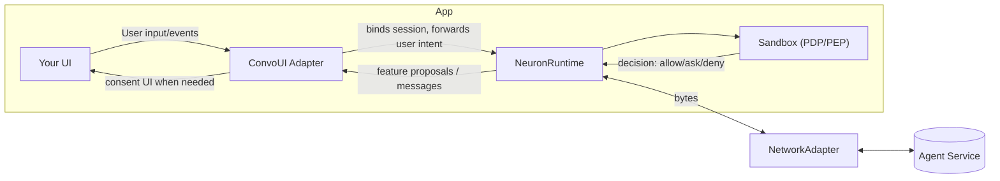

# FinClip Neuron — Developer Guide

> 📖 **Language**: [English](README.md) | [中文](README.zh.md)

## 1. Introduction

FinClip Neuron provides a runtime and SDKs to build agent‑driven experiences safely on mobile, desktop, and IoT devices. It combines:

- Capability Model‑based sandbox with fine‑grained controls (least privilege, user consent, rate limits) to let cloud agents orchestrate local functions under user permission, enabling Human‑in‑the‑Loop automation.
- A conversation runtime (NeuronKit) that turns agent proposals into safe, auditable actions.
- Device‑side context collection (e.g., location, time/schedule, network, environment, and more than a dozen categories) to accompany user intent and help agents infer intent for smarter automation. See: [`Device-side Context`](docs/context.md).
- Multi‑scene conversation management to open and continue sessions anywhere in your app, layering conversational UX on top of traditional touch/mouse interactions for seamless scene‑aware experiences, converging clickstream with dialog stream seamlessly
- Integration with a cloud Context Engine to manage user/device/app/scene data and multi‑form memories (Semantic, Short‑term, Long‑term, Episodic, Procedural), enabling better user understanding and smarter automation.

This repository publishes NeuronKit and example apps, and hosts binary XCFrameworks for SandboxSDK and convstorelib.

- Repo path to explore:
  - `finclip-neuron/examples/custom/` — a CLI example you can run with `swift run`.

---

## 2. Core Concepts

- **Capability Model-based Sandbox: Features → Capabilities → Primitives**
  - A Feature describes a high-level function (e.g., "Open Camera").
  - Each Feature requires one or more Capabilities (e.g., UI access, device sensor access).
  - Capabilities are exercised by concrete Primitives (e.g., `MobileUI(page:"/camera", component:"camera")`).

- **PDP (Policy Decision Point)**
  - Evaluates whether a proposed action is allowed. Inputs include: user presence, explicit consent, sensitivity, rate limits, historical usage.

- **PEP (Policy Enforcement Point)**
  - Enforces the PDP decision in the app runtime. If denied, the action is blocked. If allowed with consent, it prompts UI.

- **Context**
  - Device Context: device type, timezone, network/battery, etc.
  - Application/Scenario Context: app-specific state, current screen/route, business metadata.

- **Feature Invocation (Tools)**
  - Agents propose directives referencing Feature IDs and typed args. The runtime validates arguments (FeatureArgsSchema) and policies before invoking primitives.

---

## Architecture Overview



Key points:

- **ConvoUI Adapter** bridges your UI and the runtime (typical apps do not call `sendMessage` directly).
- **Sandbox** evaluates policy (PDP) and the app enforces it (PEP) by showing consent and shaping execution.
- **NetworkAdapter** is pluggable (WebSocket/HTTP/custom) and transports messages to your agent backend.

---

## 3. Installation and Dependencies

Add the package to your SwiftPM manifest:

```swift
// Package.swift
dependencies: [
  .package(url: "https://github.com/Geeksfino/finclip-neuron.git", branch: "main-swift6_0")
],

targets: [
  .executableTarget(
    name: "YourApp",
    dependencies: [
      .product(name: "NeuronKit", package: "finclip-neuron"),
      .product(name: "SandboxSDK", package: "finclip-neuron"),
      .product(name: "convstorelib", package: "finclip-neuron")
    ]
  )
]
```

Binary artifacts provided by this repo:

- `NeuronKit.xcframework`
- `SandboxSDK.xcframework`
- `convstorelib.xcframework`

---

## 4. Quick Start (Primary integration steps)

The primary SDK integration sequence is:

1) Create a configuration.
2) Initialize the runtime.
3) Get a reference to the sandbox.
4) Register features and set policies.

Setting network and ConvoUI adapters is optional/advanced. Applications typically do not call `runtime.sendMessage` directly; your chosen UI/adapter integration will drive messaging.

Minimal integration snippet:

```swift
import NeuronKit
import SandboxSDK

// 1) Configuration
// Storage is persistent by default; override with `storage: .inMemory` for tests/demos
let config = NeuronKitConfig(
  serverURL: URL(string: "wss://agent.example.com")!,
  deviceId: "demo-device",
  userId: "demo-user",
  storage: .persistent, // default; use .inMemory for tests
  contextProviders: [  // all optional. This array can be empty.
    ScreenStateProvider(),   // detect screen on/off and orientation
    ThermalStateProvider(),  // detect thermal state
    DeviceEnvironmentProvider(), // detect locale and time format
    TimeBucketProvider(), // detect time of day and week
    NetworkQualityProvider(), // detect network quality
    NetworkStatusProvider(), // detect network status
    CalendarPeekProvider(), // detect next calendar event
    BarometerProvider(), // detect ambient pressure
    DeviceStateProvider(), // iOS battery level/state
    LocationContextProvider(), // requires app to have location permission; provider will not prompt
    RoutineInferenceProvider(), // infer routine
    UrgencyEstimatorProvider() // estimate urgency
  ]
)

// 2) Initialize runtime
let runtime = NeuronRuntime(config: config)

// 3) Get sandbox reference
let sandbox = runtime.sandbox

// 4) Register Features and set Policies
let camera = SandboxSDK.Feature(
  id: "open_camera",
  name: "Open Camera",
  description: "Access device camera for photos",
  category: .Native,
  path: "/camera",
  requiredCapabilities: [.UIAccess],
  primitives: [.MobileUI(page: "/camera", component: "camera")]
)
_ = sandbox.registerFeature(camera)

_ = sandbox.setPolicy("open_camera", SandboxSDK.Policy(
  requiresUserPresent: true,
  requiresExplicitConsent: true,
  sensitivity: .medium,
  rateLimit: SandboxSDK.RateLimit(unit: .minute, max: 10)
))

// Optional (advanced): configure adapters
// runtime.setNetworkAdapter(MyWebSocketNetworkAdapter(url: URL(string: "wss://...")!))

// Open a conversation when your app is ready to converse (fluent API)
let convo = runtime.openConversation(agentId: UUID())
// Optionally bind a UI adapter for streaming messages
// convo.bindUI(MyConvoAdapter())
```

To see a working end‑to‑end demo (with a simple CLI adapter and loopback networking), run:

```bash
cd finclip-neuron/examples/custom
swift run
```

---

## 5. Sandbox Usage (Typed API, Manifest, PDP)

- **Typed API (FeatureArgsSchema)**
  - Define required/optional args and constraints for each Feature.
  - The runtime validates agent-provided args against the schema before invocation.

```swift
let exportFeature = SandboxSDK.Feature(
  id: "export_report",
  name: "Export Report",
  description: "Export a report with a given format",
  category: .Native,
  path: "/report/export",
  requiredCapabilities: [.UIAccess],
  primitives: [.MobileUI(page: "/report/export", component: "format=csv&range=last30d")],
  argsSchema: FeatureArgsSchema(
    required: ["format", "range"],
    properties: [
      "format": FeatureArgSpec(type: .string, description: "Export format", enumVals: ["csv", "xlsx"]),
      "range": FeatureArgSpec(type: .string, description: "Time range", pattern: "^(today|yesterday|last7d|last30d|mtd|ytd)$")
    ]
  )
)
```

- **Manifest**
  - You can bundle features/schemas/capabilities in a manifest and apply it at startup.

- **Policies & PDP flow**
  - Set per-feature policies with sensitivity, rate limits, and consent:

```swift
_ = sandbox.setPolicy("open_camera", SandboxSDK.Policy(
  requiresUserPresent: true,
  requiresExplicitConsent: true,
  sensitivity: .medium,
  rateLimit: SandboxSDK.RateLimit(unit: .minute, max: 10)
))
```

- **Context during evaluation**
  - Provide Device Context (timezone, device type, etc.) and App Context (current route, scenario) with each message. PDP considers these in decisions.

---

## 6. Supported Features, Capabilities, and Primitives (Reference)

Below is a reference list you can use directly without external documents.

### Feature Categories

- `Native` — App-native functionality (navigation, dialogs, media, notifications, etc.)
- `MiniApp` — Embedded micro-app/miniapp routes and JS APIs
- `IoTDevice` — Smart home/device control and automations
- `External` — Delegation to external third-party apps
- `SystemApp` — OS-provided apps (Calendar, Mail, etc.)
- `Web` — Browser/web runtime invocations

### Capabilities

- `UIAccess`
- `Network`
- `DeviceControl` (IoT)
- `Camera`
- `Microphone`
- `AudioOutput`
- `Bluetooth`
- `NFC`
- `Sensors`

### Primitives (common subset)

Mobile UI & Navigation:

- `MobileUI { page, component? }`
- `ShowDialog { title, message }`

MiniApp control:

- `MiniApp { url_path, js_api[] }`
- `InvokeJSAPI { api_name, params }`

Media & hardware:

- `CapturePhoto { params }`
- `CaptureVideo { params }`
- `RecordAudio { params }`
- `PickImage {}`
- `PickVideo {}`

File system:

- `FileOp { path, op: Read|Write|Delete }`

Network & external:

- `NetworkOp { url, method, headers?, body? }`
- `WebSocketConnect { url }`
- `OpenUrl { url, app_hint? }`

System features & apps:

- `ClipboardOp { action, text? }`
- `ShowNotification { title, body }`
- `CreateCalendarEvent { event }`
- `ComposeEmail { to?, subject? }`
- `GetCurrentLocation {}`

Audio output:

- `PlayAudio { source, volume? }`, `StopAudio {}`

Bluetooth/NFC:

- `BluetoothScan { filters? }`, `BluetoothConnect { device_id }`, `BluetoothWrite { ... }`, `BluetoothRead { ... }`
- `NfcReadTag {}`, `NfcWriteTag { payload }`

IoT control & sensors:

- `DeviceControl { device_type, action, device_id? }`
- `DevicePower { device_id, state }`
- `SetDeviceMode { device_id, mode }`
- `SetTemperature { device_id, value }`
- `SetBrightness { device_id, value }`
- `LockDevice/UnlockDevice { device_id }`
- `ReadSensor { sensor_type, device_id }`
- `ExecuteScene { scene_id }`, `SyncDeviceGroup { group_id }`

Common cross-domain:

- `ValidateUser { token }`, `CheckCapability { permission }`, `GetContext { key }`, `LogAudit { action, result }`

Note: Implementations may enable a subset per platform.

---

## 7. Network Adapters (for custom implementation)

When you want NeuronKit to communicate over your own transport (WebSocket, HTTP polling, SSE, gRPC, Bluetooth, etc.), you implement the `NetworkAdapter` protocol. The adapter sits between NeuronKit’s runtime and your server:

1. NeuronKit calls `send(_:)` whenever it has outbound JSON to deliver. Your adapter is responsible for serializing the request onto the wire (e.g., write to a socket, send an HTTP request, push to a gRPC stream).
2. Your transport delivers responses or streaming tokens. The adapter feeds those bytes back into NeuronKit by calling the provided inbound handlers.
3. The adapter reports connection state transitions so NeuronKit can surface them to the UI and apply backoff/retry policies.

### 7.1 Lifecycle & Required Surface

Every adapter must provide the following members:

- **Properties**
  - `onStateChange: ((NetworkState) -> Void)?` — Call this whenever your transport changes state (connecting/connected/reconnecting/disconnected/error).
  - `inboundDataHandler: ((Data) -> Void)?` — Call with complete message payloads (JSON) that NeuronKit should persist and route. This is typically used for non-streaming responses or the final frame of a streaming exchange.
  - `onOutboundData: ((Data) -> Void)?` — Optional callback invoked when NeuronKit enqueues an outbound payload; useful for logging/metrics. Avoid calling back into `send(_:)` inside this closure to prevent re-entrancy loops.

- **Publishers**
  - `inbound: AnyPublisher<Data, Never>` — Convenience publisher already wired up by `BaseNetworkAdapter`; most custom adapters simply use `inboundDataHandler` instead of emitting directly.
  - `state: AnyPublisher<NetworkState, Never>` — Emits connection state transitions. Again, `BaseNetworkAdapter` helps back this with `onStateChange` updates.

- **Methods**
  - `start()` — Create/connect your transport (e.g., open WebSocket, start polling loop). Set state to `.connecting`/`.connected` as appropriate.
  - `stop()` — Tear down the transport cleanly and emit `.disconnected`.
  - `send(_ data: Data)` — Serialize the outbound bytes onto the wire. If your protocol requires acknowledging the send, do so here;
    otherwise just write and return.

The `BaseNetworkAdapter` class already includes `inboundSubject` and a default implementation of the publishers; subclass it to avoid re-implementing boilerplate.

### 7.2 How Inbound Data Flows Back

When your server responds, pass those bytes back to NeuronKit:

- For **complete responses** (non-streaming), simply call `handleInboundData(_:)` or `inboundDataHandler?(payload)` with the full data blob. NeuronKit will parse and persist the message, then forward it to ConvoUI adapters.
- For **streaming transports**, emit each preview chunk through `inboundPartialDataHandler?(chunk)` (available on `BaseNetworkAdapter`). Construct an `InboundStreamChunk` with `streamId`, `sequence`, raw bytes, and a boolean `isFinal`. After the final chunk, call `handleInboundData(_:)` or `inboundDataHandler?(payload)` with the assembled response so it becomes the persisted message.
- Always call `onStateChange?` to reflect connectivity (e.g., `.connected` once the socket handshake completes, `.reconnecting` during retry, `.error` with a reason on failure).

### 7.3 Sending Outbound Payloads

NeuronKit invokes `send(_:)` with UTF-8 JSON bytes. Typical implementations:

- **WebSocket** — Convert `Data` to string or send raw binary depending on your server expectation, then call the socket’s send API.
- **HTTP** — Wrap the data in an HTTP body and post to your agent endpoint. For streaming responses, consider using long polling or upgrading to SSE/WebSocket.
- **SSE/long polling** — `send(_:)` might trigger an HTTP request while `inboundDataHandler` processes the eventual response.
- **Custom transports** — For example, Bluetooth or gRPC. Serialize the JSON into your frame format and deliver through the appropriate SDK methods.

If your transport supports acknowledgements or needs to throttle sends, handle that within `send(_:)` (e.g., queue until the connection is ready and then flush).

### 7.4 Streaming Considerations

- Coordinate with the backend on how each frame indicates preview vs final completion (see **Server contract** below). For SSE, this might be an `event: preview` / `event: complete` pattern or an `is_final` field in the JSON chunk.
- Use `InboundStreamChunk` for every preview segment. The `sequence` lets the UI render tokens in order; `messageId` ties the preview to the eventual persisted message.
- Call `handleInboundData(_:)` exactly once per conversation message—typically on the final chunk—to persist the full response and notify observers.
- Remember to clear any buffering state inside the adapter when the stream completes.

### 7.5 Example Flow

```plaintext
NeuronKit send(_:)  →  Adapter writes to transport  →  Server replies (preview)  
→ Adapter emits InboundStreamChunk via inboundPartialDataHandler  →  UI shows typing token  
→ Server sends final payload  →  Adapter calls handleInboundData(_)  →  NeuronKit persists + notifies UI
```

### 7.6 Reference Implementations

- `examples/custom/Sources/custom/adapters/WebSocketNetworkAdapter.swift`
- `examples/custom/Sources/custom/adapters/URLSessionHTTPAdapter.swift`
- `examples/custom/Sources/custom/adapters/LoopbackNetworkAdapter.swift` (synthetic)
- Template: `docs/templates/TemplateSSEAdapter.swift`

### Streaming adapters & SSE blueprint

- **Preview tokens** – The loopback, mock, WebSocket, and URLSession adapters in `examples/custom/` now emit text previews by constructing `InboundStreamChunk` values and forwarding them through `inboundPartialDataHandler`. Review those files for chunk sizing, metadata, and timing patterns. A ready-to-copy template lives in `docs/templates/TemplateSSEAdapter.swift`.
- **HTTP polling** – `MyURLSessionHTTPAdapter` shows how to decode either preview tokens (`MockPreviewEnvelope`) or fully buffered results (`MockStreamEnvelope`) before calling `handleInboundData(_:)`.
- **Server-Sent Events (SSE)** – Use `URLSessionDataDelegate` to collect frames, emit preview chunks, and forward the final payload:
- **Server contract** – Coordinate with your backend on how each frame signals “preview” versus “final.” For example, an SSE stream might send `event: preview` chunks and an `event: complete` frame, or include an `is_final` flag. Your adapter is responsible for mapping that marker to `InboundStreamChunk.isFinal` and calling `handleInboundData(_:)` exactly once per completed message.

```swift
final class SSEAdapter: BaseNetworkAdapter, URLSessionDataDelegate {
  private let url: URL
  private lazy var session = URLSession(configuration: .default,
                                        delegate: self,
                                        delegateQueue: nil)
  private var task: URLSessionDataTask?
  private var buffer = Data()

  override func start() {
    updateState(.connecting)
    task = session.dataTask(with: url)
    task?.resume()
  }

  override func stop() {
    task?.cancel()
    task = nil
    updateState(.disconnected)
  }

  func urlSession(_ session: URLSession,
                  dataTask: URLSessionDataTask,
                  didReceive data: Data) {
    buffer.append(data)

    while let range = buffer.range(of: "\n\n".data(using: .utf8)!) {
      let frame = buffer.subdata(in: 0..<range.lowerBound)
      buffer.removeSubrange(0..<range.upperBound)

      guard let parsed = SSEFrame(text: String(data: frame, encoding: .utf8) ?? "") else { continue }

      switch parsed.kind {
      case .preview(let streamId, let seq, let messageId, let token, let isFinal):
        let chunk = InboundStreamChunk(
          streamId: streamId,
          sequence: seq,
          data: Data(token.utf8),
          isFinal: isFinal,
          messageId: messageId
        )
        inboundPartialDataHandler?(chunk)

      case .final(let payload):
        handleInboundData(payload)
      }
    }
  }
}
```

---

## 8. ConvoUI Adapters (for custom implementation)

A ConvoUI adapter bridges your UI with NeuronKit.

- **Inbound flow**

  - It renders inbound messages and system notifications.
  - It receives streaming preview chunks as well as final persisted messages.

- **Streaming previews**

  Override `handleStreamingChunk(_:)` to show partial responses. A common pattern is to accumulate text keyed by `chunk.messageId` and feed it into a “typing” row in your chat UI. When `chunk.isFinal` is `true`, mark the preview so it can be cleared once the persisted `NeuronMessage` arrives. See `docs/templates/TemplateConvoUIAdapter.swift` for a ready-to-copy subclass that wires these pieces together.

- **Why dedup matters**

  Imagine the transport streams “Sure, let me check that…” token by token, and a few hundred milliseconds later the server returns the exact same sentence inside the final persisted message. Without deduplication the user would see two identical bubbles (“preview” + “final”). Tracking `messageId`/`streamId` and clearing previews when the persisted message lands eliminates this duplicate.

- **Dedup on completion**

  In `handleMessages(_:)`, compare any pending preview against the stored `NeuronMessage` (same id) and either update content or clear the preview to avoid duplicate bubbles.

- **Consent & system events**

  Override `handleConvoEvent(_:)` and `handleConsentRequest` if your UI needs to surface directive approvals.

- **Sending outbound messages**

  Call `sendMessage(_:)` / `sendMessage(_:context:)` helpers once the user submits input.

Examples:

- `examples/custom/Sources/custom/CliConvoAdapter.swift`
- `examples/custom/Sources/custom/CustomDemoApp.swift`
- `examples/ios-sample/Sources/App/MultiSessionExample.swift`

---

Context is one of the most important designs of the NeuronKit SDK. It continuously collects relevant mobile device and in‑app signals to accompany user intent so your agent can understand situation, safety posture, and preferences. This is part of modern context engineering for agent systems.

NeuronKit enriches each outbound message with device and app context to help your PDP make better decisions. Highlights:

- Register Context Providers when creating `NeuronKitConfig` to emit values on send, by TTL, or on app foreground.
- Context is delivered via a typed `DeviceContext` plus an `additionalContext: [String: String]` map for coarse signals.
- Providers never trigger OS permission dialogs; request permissions in your app before registering sensitive providers.

Quick links:

- [Full guide: `Device-side Context`](docs/context.md)

These documents include update policies, quick-start samples, the full provider reference (standard / advanced / inferred), and downstream parsing guidance.

---

## License

See LICENSE in the repository.
