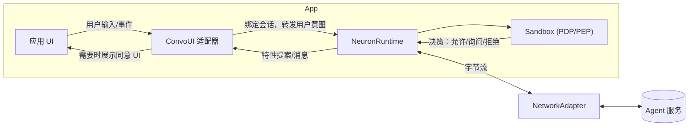

# FinClip Neuron — 开发者指南（中文）

 📖 **语言**: [English](README.md) | [中文](README.zh.md)

## 1. 介绍

FinClip Neuron 帮助你在移动端与桌面端安全地构建“智能体驱动”的体验。它包含：

- 基于能力的沙箱（Sandbox），提供最小权限、用户同意、频率限制等精细控制。
- 会话运行时（NeuronKit），将智能体的提案（指令）安全地转化为可审计的动作。
- 可插拔的网络适配器与 ConvoUI 适配器，方便你接入自有网络传输与 UI 桥接。
- 内置消息存储，默认开启持久化（可配置）。

本仓库发布 NeuronKit 以及示例应用，并提供 SandboxSDK 与 convstorelib 的二进制依赖。

- 推荐路径：
  - `finclip-neuron/examples/custom/` — CLI 快速上手示例，可直接 `swift run` 运行。
  - `neuronkit/docs/spec.md` — 概念规范与运行机制说明。

---

## 2. 核心概念

以下概念与 `neuronkit/docs/spec.md` 保持一致。

- **Feature → Capability → Primitive**
  - Feature 表达高层功能（如“打开相机”）。
  - 每个 Feature 需要一个或多个 Capability（如 UI 访问、设备传感器访问）。
  - Capability 最终由具体 Primitive 执行（如 `MobileUI(page:"/camera", component:"camera")`）。

- **PDP（策略决策点）**
  - 评估提案是否允许：考虑用户在场、显式同意、敏感级别、频控、历史使用等。

- **PEP（策略执行点）**
  - 在应用运行时执行 PDP 结果：拒绝则阻断；需要同意则弹出 UI；允许则执行。

- **上下文（Context）**
  - 设备上下文：设备类型、时区、网络/电量等。
  - 应用/场景上下文：业务路由、页面、业务标识等。

- **特性调用（工具调用）**
  - 智能体通过 Feature ID + 类型化参数（FeatureArgsSchema）提出指令。运行时在执行前会进行参数校验与策略评估。

---

## 架构总览（Architecture Overview）



要点：

- **ConvoUI 适配器** 负责桥接 UI 与运行时（典型集成中不要直接调用 `sendMessage`）。
- **Sandbox** 做策略判定（PDP），应用侧按结果执行（PEP），包括弹窗征求同意等。
- **NetworkAdapter** 可插拔（WebSocket/HTTP/自定义），用于与后端智能体传输消息。

---

## 3. 安装与依赖

在 SwiftPM 中添加依赖：

```swift
// Package.swift
dependencies: [
  .package(url: "https://github.com/Geeksfino/finclip-neuron.git", branch: "main-swift6_0")
],

targets: [
  .executableTarget(
    name: "YourApp",
    dependencies: [
      .product(name: "NeuronKit", package: "finclip-neuron"),
      .product(name: "SandboxSDK", package: "finclip-neuron"),
      .product(name: "convstorelib", package: "finclip-neuron")
    ]
  )
]
```

本仓库提供以下二进制依赖：

- `NeuronKit.xcframework`
- `SandboxSDK.xcframework`
- `convstorelib.xcframework`

---

## 4. 快速开始

运行内置示例：

```bash
cd finclip-neuron/examples/custom
swift run
```

你将看到：

- 启动 NeuronRuntime。
- 注册多个 Feature（相机、支付、通讯录、定位、通知、导出报表、MiniApp 路由）。
- 使用回环（Loopback）网络适配器模拟智能体指令。
- 使用 CLI ConvoUI 适配器展示消息与同意弹窗。

关键文件：

- `examples/custom/Sources/custom/CustomDemoApp.swift`
- `examples/custom/Sources/custom/CliConvoAdapter.swift`
- `examples/custom/Sources/custom/adapters/`（Loopback / WebSocket / HTTP 示例）

最小集成代码：

```swift
import NeuronKit
import SandboxSDK

// 配置（默认持久化，可通过 storage 指定内存模式）
let config = NeuronKitConfig(
  serverURL: URL(string: "wss://api.example.com")!,
  deviceId: "demo-device",
  userId: "demo-user",
  storage: .persistent // 默认；测试/演示可用 .inMemory
)
let runtime = NeuronRuntime(config: config)

// 打开会话（会话句柄，流式/实时）
let convo = runtime.openConversation(agentId: UUID())

// 绑定 UI 适配器到该会话
let uiAdapter = CliConvoAdapter(chatViewModel: ChatViewModel())
convo.bindUI(uiAdapter)

// 设置网络适配器（示例使用 WebSocket）
let networkAdapter = MyWebSocketNetworkAdapter(url: URL(string: "wss://your-server")!)
runtime.setNetworkAdapter(networkAdapter)

// 发送消息
try await convo.sendMessage("Hello")

// （可选）只读历史：attach + 快照分页
let attached = runtime.attachConversation(sessionId: convo.sessionId)
let firstPage = try? runtime.messagesSnapshot(sessionId: attached.sessionId, limit: 50)
let olderPage = try? runtime.messagesSnapshot(sessionId: attached.sessionId, limit: 50, before: firstPage?.first?.timestamp)
```

---

## 5. 沙箱用法：类型化 API、Manifest、PDP 流程

- **类型化 API（FeatureArgsSchema）**
  - 为每个 Feature 定义参数 schema（必填/可选/约束）。
  - 运行时在执行前会校验参数，确保与 schema 匹配。

```swift
let exportFeature = SandboxSDK.Feature(
  id: "export_report",
  name: "Export Report",
  description: "Export a report with a given format",
  category: .Native,
  path: "/report/export",
  requiredCapabilities: [.UIAccess],
  primitives: [.MobileUI(page: "/report/export", component: "format=csv&range=last30d")],
  argsSchema: FeatureArgsSchema(
    required: ["format", "range"],
    properties: [
      "format": FeatureArgSpec(type: .string, description: "Export format", enumVals: ["csv", "xlsx"]),
      "range": FeatureArgSpec(type: .string, description: "Time range", pattern: "^(today|yesterday|last7d|last30d|mtd|ytd)$")
    ]
  )
)
```

- **Manifest**
  - 可在启动时一次性应用特性清单（包含 Feature、schema 与 capabilities）。

- **策略与 PDP**
  - 为每个 Feature 设置策略（敏感度、频率限制、是否需要用户同意/在场等）：

```swift
_ = runtime.sandbox.setPolicy("open_camera", SandboxSDK.Policy(
  requiresUserPresent: true,
  requiresExplicitConsent: true,
  sensitivity: .medium,
  rateLimit: SandboxSDK.RateLimit(unit: .minute, max: 10)
))
```

- **上下文参与评估**
  - 消息携带设备上下文（时区、设备类型等）与业务上下文（当前页面/场景），PDP 会纳入评估。

---

## 6. 支持的 Features / Capabilities / Primitives

示例中包含以下常见 Feature：

- `open_camera`, `open_payment`, `access_contacts`, `get_location`, `send_notification`, `export_report`, `miniapp_order_detail`。
- 能力示例：UI 访问、设备传感器、网络、媒体等。
- 常见 Primitive：`MobileUI(page:..., component:...)`，可路由到原生或 MiniApp 流程。

完整的概念模型与可扩展性，请参考 `neuronkit/docs/spec.md`。

---

## 7. 网络适配器（自定义实现）

实现 `NetworkAdapter` 协议即可接入自有网络传输。

必需表面：

- 属性：`onOutboundData: ((Data) -> Void)?`, `onStateChange: ((NetworkState) -> Void)?`, `inboundDataHandler: ((Data) -> Void)?`
- 发布者：`inbound: AnyPublisher<Data, Never>`, `state: AnyPublisher<NetworkState, Never>`
- 方法：`start()`, `stop()`, `send(_ data: Data)`

实践建议：

- 状态变更时调用 `onStateChange?`（`.connecting/.connected/.reconnecting/.disconnected/.error`）。
- 收到网络数据时调用 `inboundSubject.send(data)` 和 `inboundDataHandler?(data)`。
- `onOutboundData?(data)` 仅用于可观察性（可选）；在 loopback/mock 路径中避免调用以防止重入。

示例：

- `examples/custom/Sources/custom/adapters/WebSocketNetworkAdapter.swift`
- `examples/custom/Sources/custom/adapters/URLSessionHTTPAdapter.swift`
- `examples/custom/Sources/custom/adapters/LoopbackNetworkAdapter.swift`（回环示例）

---

## 8. 存储配置（持久化）

NeuronKit 使用本地消息存储保存会话历史，默认“持久化”开启。可在创建 `NeuronKitConfig` 时配置：

```swift
let config = NeuronKitConfig(
  serverURL: URL(string: "wss://api.example.com")!,
  deviceId: "demo-device",
  userId: "demo-user",
  storage: .persistent // 默认
)

// 测试/演示无需持久化：
let inMemory = NeuronKitConfig(
  serverURL: URL(string: "wss://api.example.com")!,
  deviceId: "demo-device",
  userId: "demo-user",
  storage: .inMemory
)
```

- 使用发布者 `runtime.messagesPublisher(sessionId:)`（或 `convo.messagesPublisher`）获取历史+增量更新。
- 使用 `runtime.messagesSnapshot(sessionId:limit:before:)` 做分页或列表预览。

## 9. ConvoUI 适配器（自定义实现）

ConvoUI 适配器负责将你的 UI 与 NeuronKit 对接：

- 将用户输入转交给运行时（典型集成中不要直接调用 `sendMessage`）。
- 渲染智能体消息与系统提醒。
- PDP 返回需要显式同意时，展示同意 UI。

### 会话中心绑定（推荐）

新方法允许你动态地将 UI 适配器绑定/解绑到特定会话：

```swift
// 打开会话
let convo = runtime.openConversation(agentId: UUID())

// 将 UI 适配器绑定到此特定会话
let adapter = MyConvoAdapter()
convo.bindUI(adapter)

// 稍后：当 UI 不再活跃时解绑（如视图消失）
convo.unbindUI()

// 对话结束时关闭会话
convo.close()
```

### 多会话支持

现在可以有多个活跃会话，每个都有不同的 UI 适配器：

```swift
// 为不同上下文创建会话
let supportConvo = runtime.openConversation(agentId: UUID())
let salesConvo = runtime.openConversation(agentId: UUID())

// 将不同适配器绑定到各自会话
supportConvo.bindUI(supportAdapter)
salesConvo.bindUI(salesAdapter)

// 稍后：关闭会话
supportConvo.close()
salesConvo.close()
```

示例：

- `examples/custom/Sources/custom/CliConvoAdapter.swift`
- `examples/custom/Sources/custom/CustomDemoApp.swift`
- `examples/ios-sample/Sources/App/MultiSessionExample.swift`

---

## 10. Context provider（设备与应用上下文）

Context provider 用于为出站消息自动补充设备与应用上下文，便于 PDP 策略做更准确的决策（例如：按时段限流、根据网络质量调整交互、在敏感场景要求显式同意等）。

### 总览

- provider 是轻量组件，按策略（发送时/按 TTL/前台刷新）提供值。
- 值会合并到出站信封的 `additionalContext: [String: String]` 以及强类型的 `DeviceContext` 字段中。
- 你在创建 `NeuronKitConfig` 时注册 provider。

### 刷新策略（policies）

- `.onMessageSend` — 每次发送消息时计算最新值。
- `.every(ttl)` — 计算后在 TTL 内复用缓存。
- `.onAppForeground` — App 进入前台时计算（或调用 `await runtime.refreshContextOnForeground()` 时执行）。

### 快速上手

```swift
import NeuronKit

let quality  = NetworkQualityProvider(updatePolicy: .onMessageSend)
let calendar = CalendarPeekProvider(updatePolicy: .every(300))
let routine  = RoutineInferenceProvider(updatePolicy: .every(900))
let urgency  = UrgencyEstimatorProvider(updatePolicy: .onMessageSend)

let cfg = NeuronKitConfig(
  serverURL: URL(string: "wss://agent.example.com")!,
  deviceId: "demo-device", userId: "demo-user",
  contextProviders: [quality, calendar, routine, urgency]
)
let runtime = NeuronRuntime(config: cfg)

// 通过 Conversation 发送消息时，SDK 会自动富集上下文
let convo = runtime.openConversation(agentId: UUID())
try await convo.sendMessage("Hello")
```

### provider 分类（快速参考）

- 标准provider（映射到 `DeviceContext`）：
  - `ScreenStateProvider` → `screenOn`, `orientation`
  - `ThermalStateProvider` → `thermalState`
  - `DeviceEnvironmentProvider` → `locale`, `is24Hour`
  - `TimeBucketProvider` → `daySegment`, `weekday`

- 高级provider（附加上下文 key-value）：
  - `NetworkQualityProvider` → `network.quality`（good|fair|none|unknown）
  - `CalendarPeekProvider` → `social.calendar_next_event`（true|false）、`social.calendar_next_event.start_ts`（epoch 秒）
  - `BarometerProvider`（仅 iOS）→ `env.pressure_kPa`（数值字符串）

- 衍生provider（可选，推断的附加上下文）：
  - `RoutineInferenceProvider` → `inferred.routine`, `inferred.routine.confidence`
  - `UrgencyEstimatorProvider` → `inferred.urgency`, `inferred.urgency.rationale`

说明：

- 附加上下文建议仅使用粗粒度、隐私友好的字符串/数值，避免包含 PII。
- provider 不会主动触发系统权限弹窗；在未授权或不可用时返回 `nil`。请在 App 中先请求权限，再注册相关 provider。

### 下游读取（后端/日志）

在你的服务端或遥测流水线中解析出站消息信封：

- 直接读取 `DeviceContext` 字段（如 timezone、deviceType、networkType）。
- 读取附加上下文键值，如 `network.quality`、`social.calendar_next_event`、`inferred.urgency` 等。

---

## 许可

参见仓库中的 LICENSE。
