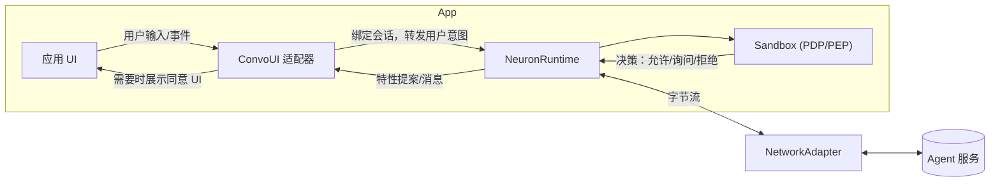

# FinClip Neuron — 开发者指南（中文）

 📖 **语言**: [English](README.md) | [中文](README.zh.md)

## 1. 介绍

FinClip Neuron 帮助你在移动端、桌面端、物联网设备上安全地构建“智能体驱动”的体验。它包含：

- 基于能力模型（Capability Model）的安全沙箱（Sandbox），提供最小权限、用户同意、频率限制等精细控制，让云端智能体能在用户许可下，对本地功能进行调度，实现人机协同（Human in the loop）的自动化
- 会话运行时（NeuronKit），将智能体的提案（指令）安全地转化为可审计的动作
- 结合设备端场景数据例如地理位置、时间日程、网络、环境等不下十多类（[设备端上下文](docs/context.zh.md)）数据内容，协助智能体识别用户意向，实现更智能的自动化
- 多场景的会话管理，支持在App内任何页面下开启和继续会话，在传统的触控型、鼠标点击型的人机交互方式上，叠加AI时代的会话型人机交互方式，让当前会话与当前UI页面达成场景融合，实现更流畅的交互体验，达成“点击流”与“会话流”的“合流”
- 接入云端上下文管理引擎（Context Engine），对用户、设备、应用、场景等多维度数据进行管理，实现以用户为中心的跨设备、跨场景、跨会话的多形态记忆 -如语义记忆（Semantic Memory）、短期记忆（Short-term Memory）、长期记忆（Long-term Memory）、场景记忆（Episodic Memory）、程序记忆（Procedural Memory）等，让所对接的智能体能更好地理解用户，实现更智能的自动化

本仓库发布 NeuronKit 以及示例应用，并提供 SandboxSDK 与 convstorelib 的二进制依赖。

- 推荐路径：
  - `finclip-neuron/examples/custom/` — CLI 快速上手示例，可直接 `swift run` 运行。
- 详细开发指南请参阅 [`docs/developer-guide.zh.md`](docs/developer-guide.zh.md)。

---

## 2. 核心概念

- **基于能力模型的沙盒：Feature → Capability → Primitive**
  - Feature 表达高层功能（如“打开相机”）。
  - 每个 Feature 需要一个或多个 Capability（如 UI 访问、设备传感器访问）。
  - Capability 最终由具体 Primitive 执行（如 `MobileUI(page:"/camera", component:"camera")`）。

- **PDP（策略决策点）**
  - 评估提案是否允许：考虑用户在场、显式同意、敏感级别、频控、历史使用等。

- **PEP（策略执行点）**
  - 在应用运行时执行 PDP 结果：拒绝则阻断；需要同意则弹出 UI；允许则执行。

- **上下文（Context）**
  - 设备上下文：设备类型、时区、网络/电量等。
  - 应用/场景上下文：业务路由、页面、业务标识等。

- **特性调用（工具调用）**
  - 智能体通过 Feature ID + 类型化参数（FeatureArgsSchema）提出指令。运行时在执行前会进行参数校验与策略评估。

---

## 架构总览（Architecture Overview）



要点：

- **ConvoUI 适配器** 负责桥接 UI 与运行时（典型集成中不要直接调用 `sendMessage`）。
- **Sandbox** 做策略判定（PDP），应用侧按结果执行（PEP），包括弹窗征求同意等。
- **NetworkAdapter** 可插拔（WebSocket/HTTP/自定义），用于与后端智能体传输消息。

---

## 3. 安装与依赖

在 SwiftPM 中添加依赖：

```swift
// Package.swift
dependencies: [
  .package(url: "https://github.com/Geeksfino/finclip-neuron.git", branch: "main-swift6_0")
],

targets: [
  .executableTarget(
    name: "YourApp",
    dependencies: [
      .product(name: "NeuronKit", package: "finclip-neuron"),
      .product(name: "SandboxSDK", package: "finclip-neuron"),
      .product(name: "convstorelib", package: "finclip-neuron")
    ]
  )
]
```

本仓库提供以下二进制依赖：

- `NeuronKit.xcframework`
- `SandboxSDK.xcframework`
- `convstorelib.xcframework`

---

## 4. 快速开始

运行内置示例：

```bash
cd finclip-neuron/examples/custom
swift run
```

你将看到：

- 启动 NeuronRuntime。
- 注册多个 Feature（相机、支付、通讯录、定位、通知、导出报表、MiniApp 路由）。
- 使用回环（Loopback）网络适配器模拟智能体指令。
- 使用 CLI ConvoUI 适配器展示消息与同意弹窗。

关键文件：

- `examples/custom/Sources/custom/CustomDemoApp.swift`
- `examples/custom/Sources/custom/CliConvoAdapter.swift`
- `examples/custom/Sources/custom/adapters/`（Loopback / WebSocket / HTTP 示例）

最小集成代码：

```swift
import NeuronKit
import SandboxSDK

// 配置（默认持久化，可通过 storage 指定内存模式）
let config = NeuronKitConfig(
  serverURL: URL(string: "wss://api.example.com")!,
  deviceId: "demo-device",
  userId: "demo-user",
  storage: .persistent, // 默认；测试/演示可用 .inMemory
  contextProviders: [  // 所有项均可选。此数组可以为空。
    ScreenStateProvider(),   // 屏幕开关/方向
    ThermalStateProvider(),  // 热压力
    DeviceEnvironmentProvider(), // 语言与 24 小时制
    TimeBucketProvider(), // 时间分段/星期
    NetworkQualityProvider(), // 网络质量
    NetworkStatusProvider(), // 网络类型（wifi/cellular 等）
    CalendarPeekProvider(), // 近期日历事件
    BarometerProvider(), // 环境气压（iOS）
    DeviceStateProvider(), // 电池电量/状态（iOS）
    LocationContextProvider(), // 需要已有定位权限，Provider 不主动弹窗
    RoutineInferenceProvider(), // 日常模式推断
    UrgencyEstimatorProvider() // 紧急程度估计
  ]
)
let runtime = NeuronRuntime(config: config)

// 打开会话（会话句柄，流式/实时）
let convo = runtime.openConversation(agentId: UUID())

// 绑定 UI 适配器到该会话
let uiAdapter = CliConvoAdapter(chatViewModel: ChatViewModel())
convo.bindUI(uiAdapter)

// 设置网络适配器（示例使用 WebSocket）
let networkAdapter = MyWebSocketNetworkAdapter(url: URL(string: "wss://your-server")!)
runtime.setNetworkAdapter(networkAdapter)

// 发送消息
try await convo.sendMessage("Hello")

// （可选）只读历史：attach + 快照分页
let attached = runtime.attachConversation(sessionId: convo.sessionId)
let firstPage = try? runtime.messagesSnapshot(sessionId: attached.sessionId, limit: 50)
let olderPage = try? runtime.messagesSnapshot(sessionId: attached.sessionId, limit: 50, before: firstPage?.first?.timestamp)
```

---

## 5. 沙箱用法（类型化 API、Manifest、PDP）

- **类型化 API（FeatureArgsSchema）**
  - 为每个 Feature 定义必填/可选参数与约束。
  - 运行时会在调用前校验智能体提供的参数是否符合 Schema。

```swift
let exportFeature = SandboxSDK.Feature(
  id: "export_report",
  name: "Export Report",
  description: "Export a report with a given format",
  category: .Native,
  path: "/report/export",
  requiredCapabilities: [.UIAccess],
  primitives: [.MobileUI(page: "/report/export", component: "format=csv&range=last30d")],
  argsSchema: FeatureArgsSchema(
    required: ["format", "range"],
    properties: [
      "format": FeatureArgSpec(type: .string, description: "Export format", enumVals: ["csv", "xlsx"]),
      "range": FeatureArgSpec(type: .string, description: "Time range", pattern: "^(today|yesterday|last7d|last30d|mtd|ytd)$")
    ]
  )
)
```

- **Manifest**
  - 可在启动时批量加载 Feature、Schema 与 Capability。

- **策略与 PDP 流程**
  - 通过 `sandbox.setPolicy` 为每个 Feature 设置敏感级别、频率限制与显式同意要求：

```swift
_ = sandbox.setPolicy("open_camera", SandboxSDK.Policy(
  requiresUserPresent: true,
  requiresExplicitConsent: true,
  sensitivity: .medium,
  rateLimit: SandboxSDK.RateLimit(unit: .minute, max: 10)
))
```

- **评估时的上下文**
  - 随每条消息附带设备上下文（时区、设备类型等）与应用上下文（当前路由、业务场景）。PDP 会在策略判定时一并考虑。

关于已支持的 Feature、Capability、Primitive，请参阅[支持的特性、能力与基础操作](docs/developer-guide.zh.md#sandbox--security)。

---

## 6. 存储配置（持久化）

NeuronKit 使用本地消息存储保存会话历史，默认“持久化”开启。可在创建 `NeuronKitConfig` 时配置：

```swift
let config = NeuronKitConfig(
  serverURL: URL(string: "wss://api.example.com")!,
  deviceId: "demo-device",
  userId: "demo-user",
  storage: .persistent // 默认
)

// 测试/演示无需持久化：
let inMemory = NeuronKitConfig(
  serverURL: URL(string: "wss://api.example.com")!,
  deviceId: "demo-device",
  userId: "demo-user",
  storage: .inMemory
)
```

## 9. ConvoUI 适配器

ConvoUI 适配器负责将你的 UI 与 NeuronKit 对接：

- 将用户输入转交给运行时（典型集成中不要直接调用 `sendMessage`）。
- 渲染智能体消息与系统提醒。
- PDP 返回需要显式同意时，展示同意 UI。
- 接收流式预览 chunk（逐片段 streaming）以及最终持久化消息。
- [`docs/templates/TemplateConvoUIAdapter.swift`](docs/templates/TemplateConvoUIAdapter.swift) 提供了一个可直接复制的子类，已经实现了流式预览积累、去重以及同意处理样板代码。

- **流式预览如何处理**  
  重写 `handleStreamingChunk(_:)`，按照 `chunk.messageId`（或 `streamId`）累计文本，并在 UI 中展示“正在输入”效果。若 `chunk.isFinal == true`，需记录该消息以便最终消息落库时清除预览。
- **为何需要去重**  
  例如服务端先逐段推送“好的，我来查一下……”的实时预览片段，随后将同一句完整文本作为最终 `NeuronMessage` 返回。如果不清除预览，用户会看到两条内容相同的气泡（预览 + 持久化）。追踪 `messageId`/`streamId` 并在最终消息到达后清除即可避免重复。
- **完成时如何合并**  
  在 `handleMessages(_:)` 中对比最新的 `NeuronMessage` 与预览文本，若内容一致则移除预览或合并内容，确保界面只保留最终气泡。
- **同意与系统事件**  
  重写 `handleConvoEvent(_:)` / `handleConsentRequest`，在 UI 中呈现审批提示或系统消息。
- **发送出站消息**  
  调用 `sendMessage(_:)` 或 `sendMessage(_:context:)` 将用户输入传回 NeuronKit。

---

## 8. 上下文

上下文是 NeuronKit SDK 最重要的设计之一。它持续收集与用户意图相关的移动设备与应用内信号，并随消息一并发送给智能体，帮助其理解当下情境、安全态势与偏好。这属于智能体系统中的“上下文工程”。

NeuronKit 会为每条出站消息自动富集设备与应用上下文，帮助 PDP 做出更优决策。

- 在创建 `NeuronKitConfig` 时注册 Context provider，可在发送时/按 TTL/前台刷新生成值。
- 上下文通过强类型的 `DeviceContext` 与 `additionalContext: [String: String]`（粗粒度信号）传递。
- provider 不会触发系统权限弹窗；请在 App 中先请求权限，再注册相关 provider。

快速链接：

- [设备端的上下文](docs/context.zh.md)
  
上述文档包含刷新策略、快速上手示例、完整的 provider 参考（标准/高级/衍生），以及后端解析指引。

---

## 许可

参见仓库中的 LICENSE。
